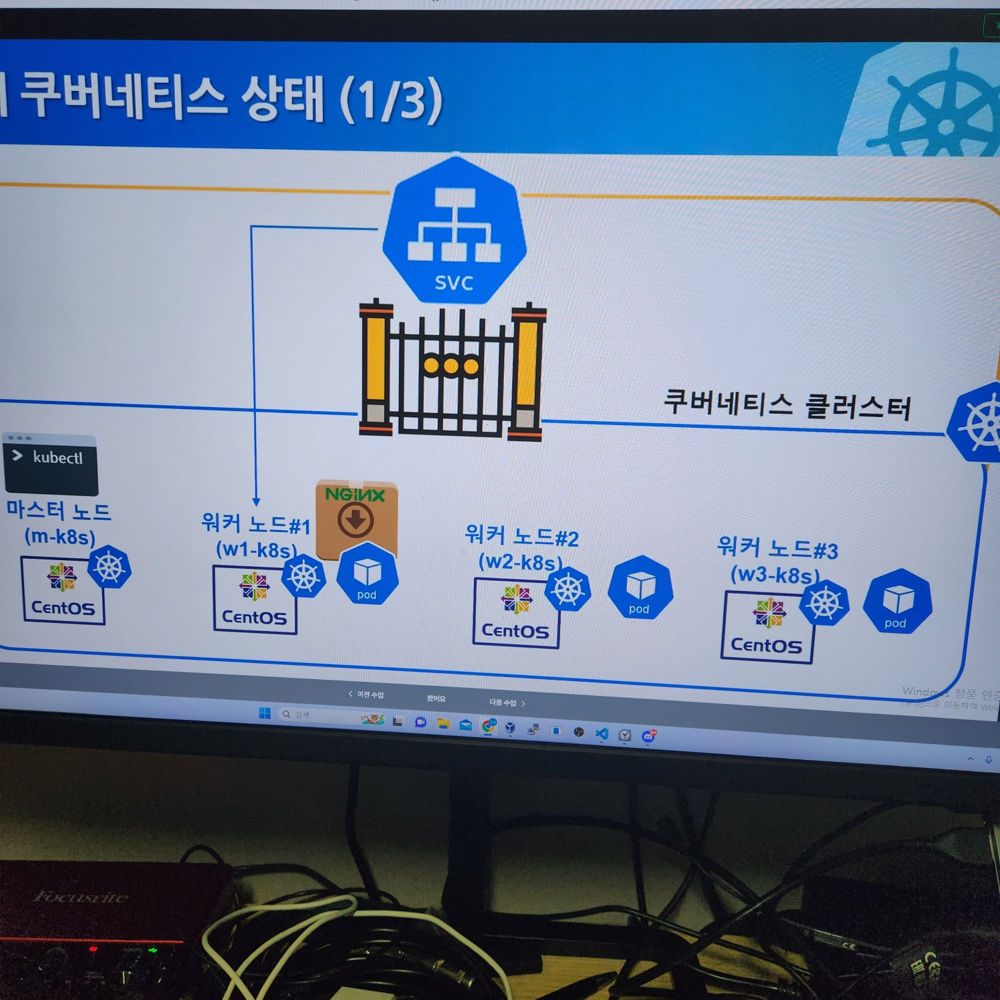
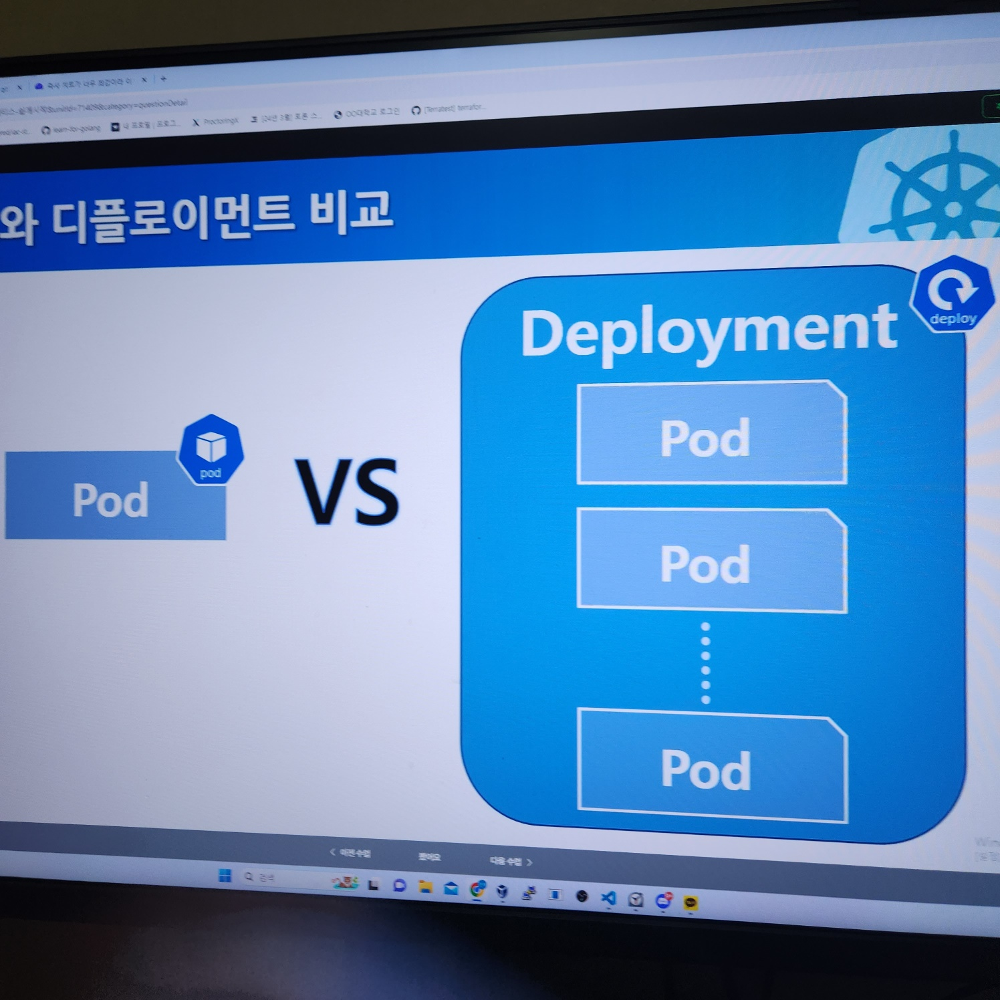

[< Backaward](../README.md)

# Basic Kubernetes

[Origin Vagrant File](../sample_repo/ch1/1.2/k8s-min-5GiB/Vagrantfile)


```shell
##################
# [Host Machine] #
##################

vagrant init
vagrant validate
vagrant up
vagrant destroy <NAME\>
vagrant provision <NAME\>

vagrant global-status
vagrant ssh <VIRTUAL_MACHINE_NAME>
```

## 1. Nodes

```shell
#######################
# [Kubernetes Server] #
#######################

kubectl get nodes
# [root@m-k8s vagrant]# kubectl get nodes
# NAME     STATUS   ROLES           AGE   VERSION
# m-k8s    Ready    control-plane   49m   v1.25.0
# w1-k8s   Ready    <none>          43m   v1.25.0
# w3-k8s   Ready    <none>          15m   v1.25.0

kubectl get nodes -o wide
# [root@m-k8s vagrant]# kubectl get nodes -o wide
# NAME     STATUS   ROLES           AGE   VERSION   INTERNAL-IP     EXTERNAL-IP   OS-IMAGE                KERNEL-VERSION                CONTAINER-RUNTIME
# m-k8s    Ready    control-plane   49m   v1.25.0   192.168.1.10    <none>        CentOS Linux 7 (Core)   3.10.0-1160.90.1.el7.x86_64   containerd://1.6.7
# w1-k8s   Ready    <none>          43m   v1.25.0   192.168.1.101   <none>        CentOS Linux 7 (Core)   3.10.0-1160.90.1.el7.x86_64   containerd://1.6.7
# w3-k8s   Ready    <none>          15m   v1.25.0   192.168.1.103   <none>        CentOS Linux 7 (Core)   3.10.0-1160.90.1.el7.x86_64   containerd://1.6.7
```

## 2. Pod

```shell
#######################
# [Kubernetes Server] #
#######################

kubectl get pod
# [root@m-k8s vagrant]# kubectl get pod
# No resources found in default namespace.

kubectl run nginx --image=nginx
# [root@m-k8s vagrant] # kubectl run nginx --image=nginx
# pod/nginx created

kubectl get pod
# [root@m-k8s vagrant]# kubectl get pod
# NAME    READY   STATUS    RESTARTS   AGE
# nginx   1/1     Running   0          97s

kubectl get pod -o wide
# [root@m-k8s vagrant]# kubectl get pod -o wide
# NAME    READY   STATUS    RESTARTS   AGE    IP             NODE     NOMINATED NODE   READINESS GATES
# nginx   1/1     Running   0          100s   172.16.132.1   w3-k8s   <none>           <none>
```

## 3. SVC : Access To Pod

```shell
##################
# [Host Machine] #
##################

ping 172.16.132.1
# Ping 172.16.132.1 32바이트 데이터 사용:
# 요청 시간이 만료되었습니다.
# 요청 시간이 만료되었습니다.
# 요청 시간이 만료되었습니다.
# 요청 시간이 만료되었습니다.

# 172.16.132.1에 대한 Ping 통계:
#     패킷: 보냄 = 4, 받음 = 0, 손실 = 4 (100% 손실),
```

### 3.a. Solutions

- Destroy network firewall [BAD!!!!]
- Create SVC(Service) in DMZ

```shell
#######################
# [Kubernetes Server] #
#######################

kubectl expose pod nginx --type=NodePort --port=80
# [root@m-k8s vagrant]# kubectl expose pod nginx --type=NodePort --port=80
# service/nginx exposed

kubectl get service
# [root@m-k8s vagrant]# kubectl get service
# NAME         TYPE        CLUSTER-IP       EXTERNAL-IP   PORT(S)        AGE
# kubernetes   ClusterIP   10.96.0.1        <none>        443/TCP        60m
# nginx        NodePort    10.104.108.111   <none>        80:`31003`/TCP   5m37s

kubectl get nodes -o wide
# [root@m-k8s vagrant]# kubectl get nodes -o wide
# NAME     STATUS   ROLES           AGE   VERSION   INTERNAL-IP     EXTERNAL-IP   OS-IMAGE                KERNEL-VERSION                CONTAINER-RUNTIME
# m-k8s    Ready    control-plane   59m   v1.25.0   192.168.1.10    <none>        CentOS Linux 7 (Core)   3.10.0-1160.90.1.el7.x86_64   containerd://1.6.7
# w1-k8s   Ready    <none>          53m   v1.25.0   `192.168.1.101` <none>        CentOS Linux 7 (Core)   3.10.0-1160.90.1.el7.x86_64   containerd://1.6.7
# w3-k8s   Ready    <none>          26m   v1.25.0   192.168.1.103   <none>        CentOS Linux 7 (Core)   3.10.0-1160.90.1.el7.x86_64   containerd://1.6.7

curl http://192.168.1.101:31003/
# curl http://`192.168.1.101`:`31003`/
```

## 4. Deploy





- Guide

```shell
kubectl run
# < 1.18    : Pod / Deploy
# >= 1.18   : Pod

kubectl create
# *         : Pod / Deploy

kubectl apply
# *         : Pod / Deploy
# needs yaml file
```
- Step 1

```shell
kubectl create deployment deploy-nginx --image=nginx
# kubectl create deployment <NAME> --image=<IMG_NAME>

kubectl get pods
# [root@m-k8s vagrant]# kubectl get pods
# NAME                            READY   STATUS    RESTARTS   AGE
# deploy-nginx-67c78b5cfc-96kgz   1/1     Running   0          12s
# nginx                           1/1     Running   0          22m

kubectl get pods -o wide
# [root@m-k8s vagrant]# kubectl get pods -o wide
# NAME                            READY   STATUS    RESTARTS   AGE   IP             NODE     NOMINATED NODE   READINESS GATES
# deploy-nginx-67c78b5cfc-96kgz   1/1     Running   0          28s   172.16.132.2   w3-k8s   <none>           <none>
# nginx                           1/1     Running   0          23m   172.16.132.1   w3-k8s   <none>           <none>

curl 172.16.132.2
# [root@m-k8s vagrant]# curl 172.16.132.2
# <!DOCTYPE html>
# <html>
# <head>
# <title>Welcome to nginx!</title>
# <style>
# html { color-scheme: light dark; }
# body { width: 35em; margin: 0 auto;
# font-family: Tahoma, Verdana, Arial, sans-serif; }
# </style>
# </head>
# <body>
# <h1>Welcome to nginx!</h1>
# <p>If you see this page, the nginx web server is successfully installed and
# working. Further configuration is required.</p>

# <p>For online documentation and support please refer to
# <a href="http://nginx.org/">nginx.org</a>.<br/>
# Commercial support is available at
# <a href="http://nginx.com/">nginx.com</a>.</p>

# <p><em>Thank you for using nginx.</em></p>
# </body>
# </html>
```

- Step 2 Increase Deploy Pod Maximum Scale

```shell
kubectl scale deployment deploy-nginx --replicas=3
# [root@m-k8s vagrant]# kubectl scale deployment deploy-nginx --replicas=3
# deployment.apps/deploy-nginx scaled

kubectl get pods
# [root@m-k8s vagrant]# kubectl get pods
# NAME                            READY   STATUS              RESTARTS   AGE
# deploy-nginx-67c78b5cfc-96kgz   1/1     Running             0          3m28s
# deploy-nginx-67c78b5cfc-f6z52   0/1     ContainerCreating   0          5s
# deploy-nginx-67c78b5cfc-fvvwl   1/1     Running             0          5s
# nginx                           1/1     Running             0          26m
```

- Step 3 Expose Deploy with NodePort

```shell
kubectl expose deployment deploy-nginx --type=NodePort --port=80
# [root@m-k8s vagrant]# kubectl expose deployment deploy-nginx --type=NodePort --port=80
# service/deploy-nginx exposed

kubectl get services
# [root@m-k8s vagrant]# kubectl get services
# NAME           TYPE        CLUSTER-IP       EXTERNAL-IP   PORT(S)        AGE
# deploy-nginx   NodePort    10.101.73.61     <none>        80:30112/TCP   14s
# kubernetes     ClusterIP   10.96.0.1        <none>        443/TCP        77m
# nginx          NodePort    10.104.108.111   <none>        80:31003/TCP   22m

kubectl get nodes -o wide
# [root@m-k8s vagrant]# kubectl get nodes -o wide
# NAME     STATUS   ROLES           AGE   VERSION   INTERNAL-IP     EXTERNAL-IP   OS-IMAGE                KERNEL-VERSION                CONTAINER-RUNTIME
# m-k8s    Ready    control-plane   77m   v1.25.0   192.168.1.10    <none>        CentOS Linux 7 (Core)   3.10.0-1160.90.1.el7.x86_64   containerd://1.6.7
# w1-k8s   Ready    <none>          71m   v1.25.0   192.168.1.101   <none>        CentOS Linux 7 (Core)   3.10.0-1160.90.1.el7.x86_64   containerd://1.6.7
# w3-k8s   Ready    <none>          44m   v1.25.0   192.168.1.103   <none>        CentOS Linux 7 (Core)   3.10.0-1160.90.1.el7.x86_64   containerd://1.6.7
```

```shell
curl 192.168.1.101:30112
curl 192.168.1.103:30112
# ~>curl 192.168.1.101:30112
# <!DOCTYPE html>
# <html>
# <head>
# <title>Welcome to nginx!</title>
# <style>
# html { color-scheme: light dark; }
# body { width: 35em; margin: 0 auto;
# font-family: Tahoma, Verdana, Arial, sans-serif; }
# </style>
# </head>
# <body>
# <h1>Welcome to nginx!</h1>
# <p>If you see this page, the nginx web server is successfully installed and
# working. Further configuration is required.</p>

# <p>For online documentation and support please refer to
# <a href="http://nginx.org/">nginx.org</a>.<br/>
# Commercial support is available at
# <a href="http://nginx.com/">nginx.com</a>.</p>

# <p><em>Thank you for using nginx.</em></p>
# </body>
# </html>
```

- Step 4 Expose Deploy with MetalLB as LoadBalancer

NodePort는 개별 Pod의 Internal Ip가 노출되는 점에서 위험하다.
따라서 LoadBalacner를 이용해서 개별 Pod로 연결되는 로드 밸런서용 External Ip를 사용하는 것이 합리적이다.

```shell
kubectl apply -f ~/_Lecture_k8s_starter.kit/ch2/2.4/metallb.yaml
# [root@m-k8s vagrant]# kubectl apply -f ~/_Lecture_k8s_starter.kit/ch2/2.4/metallb.yaml
# namespace/metallb-system created
# serviceaccount/controller created
# serviceaccount/speaker created
# clusterrole.rbac.authorization.k8s.io/metallb-system:controller created
# clusterrole.rbac.authorization.k8s.io/metallb-system:speaker created
# role.rbac.authorization.k8s.io/config-watcher created
# role.rbac.authorization.k8s.io/pod-lister created
# role.rbac.authorization.k8s.io/controller created
# clusterrolebinding.rbac.authorization.k8s.io/metallb-system:controller created
# clusterrolebinding.rbac.authorization.k8s.io/metallb-system:speaker created
# rolebinding.rbac.authorization.k8s.io/config-watcher created
# rolebinding.rbac.authorization.k8s.io/pod-lister created
# rolebinding.rbac.authorization.k8s.io/controller created
# daemonset.apps/speaker created
# deployment.apps/controller created
# configmap/config created

kubectl create deployment chk-hn --image=sysnet4admin/chk-hn
# [root@m-k8s vagrant]# kubectl create deployment chk-hn --image=sysnet4admin/chk-hn
# deployment.apps/chk-hn created

kubectl get deployment
# [root@m-k8s vagrant]# kubectl get deployment
# NAME           READY   UP-TO-DATE   AVAILABLE   AGE
# chk-hn         0/1     1            0           13s
# deploy-nginx   3/3     3            3           16h

kubectl scale deployment chk-hn --replicas=3
# [root@m-k8s vagrant]# kubectl scale deployment chk-hn --replicas=3
# deployment.apps/chk-hn scaled

kubectl get deployment
# [root@m-k8s vagrant]# kubectl get deployment
# NAME           READY   UP-TO-DATE   AVAILABLE   AGE
# chk-hn         1/3     3            1           30s
# deploy-nginx   3/3     3            3           16h

kubectl get services
# [root@m-k8s vagrant]# kubectl get services
# NAME           TYPE        CLUSTER-IP       EXTERNAL-IP   PORT(S)        AGE
# deploy-nginx   NodePort    10.101.73.61     <none>        80:30112/TCP   16h       
# kubernetes     ClusterIP   10.96.0.1        <none>        443/TCP        18h       
# nginx          NodePort    10.104.108.111   <none>        80:31003/TCP   17h       

kubectl expose deployment chk-hn --type=LoadBalancer --port=80
# [root@m-k8s vagrant]# kubectl expose deployment chk-hn --type=LoadBalancer --port=80
# service/chk-hn exposed

kubectl get services
# [root@m-k8s vagrant]# kubectl get services
# NAME           TYPE           CLUSTER-IP       EXTERNAL-IP    PORT(S)        AGE
# chk-hn         LoadBalancer   10.105.169.154   192.168.1.11   80:32291/TCP   6s    
# deploy-nginx   NodePort       10.101.73.61     <none>         80:30112/TCP   16h   
# kubernetes     ClusterIP      10.96.0.1        <none>         443/TCP        18h   
# nginx          NodePort       10.104.108.111   <none>         80:31003/TCP   17h   

kubectl get pods -o wide
# [root@m-k8s vagrant]# kubectl get pods -o wide
# NAME                            READY   STATUS    RESTARTS       AGE     IP               NODE     NOMINATED NODE   READINESS GATES
# chk-hn-7c4c768876-889ng         1/1     Running   1 (67s ago)    3m44s   172.16.132.7     w3-k8s   <none>           <none>
# chk-hn-7c4c768876-8qbxk         1/1     Running   0              3m19s   172.16.221.138   w1-k8s   <none>           <none>
# chk-hn-7c4c768876-pmzrd         1/1     Running   1 (67s ago)    3m19s   172.16.132.6     w3-k8s   <none>           <none>
# deploy-nginx-67c78b5cfc-7sd5l   1/1     Running   0              5m38s   172.16.221.135   w1-k8s   <none>           <none>
# deploy-nginx-67c78b5cfc-f6z52   1/1     Running   2 (8m9s ago)   16h     172.16.221.134   w1-k8s   <none>           <none>
# deploy-nginx-67c78b5cfc-w2d58   1/1     Running   0              5m38s   172.16.221.136   w1-k8s   <none>           <none>
```

## 5. Clean up

```shell
kubectl delete service <SERVICE_NAME>

kubectl delete deployment <DEPLOYMENT_NAME>

kubectl delete -f ~/_Lecture_k8s_starter.kit/ch2/2.4/metallb.yaml
```
